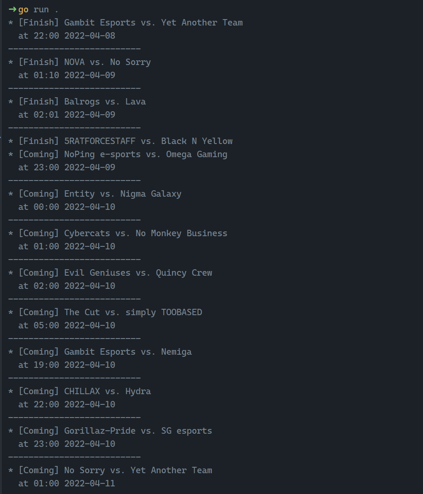

# Dota2 Matches Track

[](https://github.com/vuon9/d2m/actions/workflows/go.yml)

To check scheduled matches of Dota 2 games as local time

## How to use
```bash
# install
go install github.com/vuon9/d2m

# then
d2m
```

## Sample


## WIP:
- Configuration file
- Cache credentials with a specific time range?
- Filter by status [Finish, Coming, Live] on CLI
- Today matches
- Customize local timezone