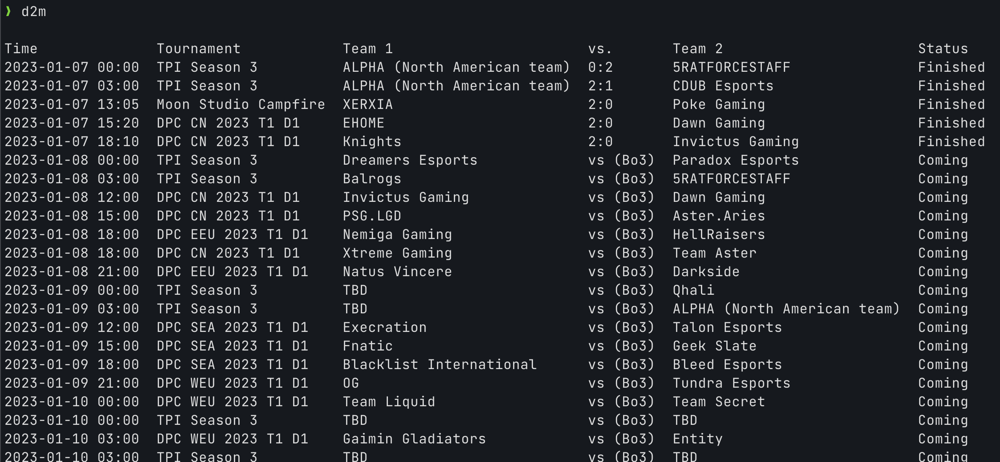
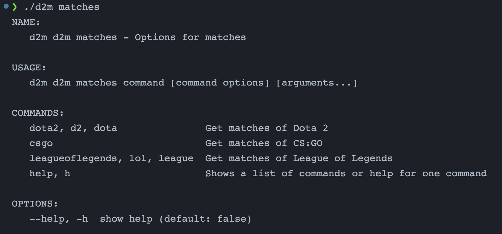
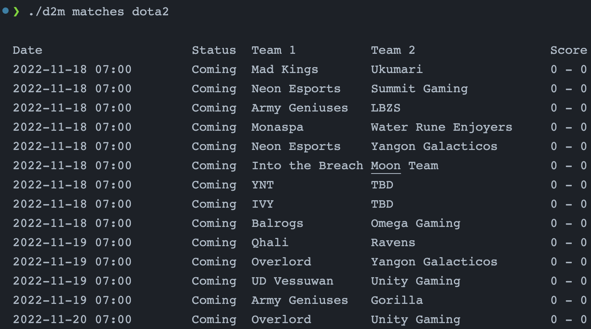

# D2M - E-sport scheduled matches tracker

[](https://github.com/vuon9/d2m/actions/workflows/go.yml)

To check scheduled matches of Dota 2 games as local time

## Installation
```bash
# install
go install github.com/vuon9/d2m@latest
```

## Screenshots





## WIP features
- Cache credentials with a specific time range?
- Filter by status [Finish, Coming, Live] on matches page
- CLI: Today matches
- CLI: Customize local timezone